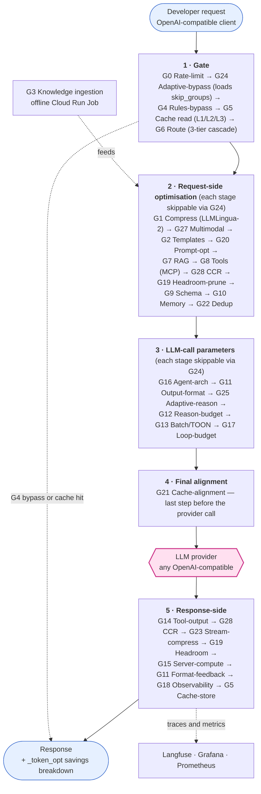

<p align="center">
  
</p>

<p align="center">
  <strong>TokenLean — the Token Optimisation Proxy.</strong><br>
  Cut your LLM token bill 30–70% with a one-line code change and zero quality loss.
</p>

[](https://github.com/sumitdevgupto/TokenLean/actions/workflows/ci.yml)
[](LICENSE)
[](https://www.python.org/downloads/)
[](#g0g28-optimisation-groups)
[](https://github.com/sumitdevgupto/TokenLean/stargazers)

**TokenLean** is a production-ready proxy (run locally or GCP-hosted) that sits between your app and any LLM provider and transparently shrinks every request — prompt compression, semantic caching, model routing, prefix-cache alignment, structured pruning, and **22 more techniques**. Point your existing OpenAI client at it and keep your code exactly as-is.

🎯 **55.78% measured** token savings in live ablation &nbsp;·&nbsp; 🔌 **10 first-class providers** + any OpenAI-compatible API &nbsp;·&nbsp; 🧩 **27 techniques** (G0–G28, G26 reserved) &nbsp;·&nbsp; 🏷️ **100% open source** (Apache-2.0) &nbsp;·&nbsp; 💸 **scales to zero** (~$2/mo idle on Cloud Run)

**Why teams use it:**
- 🪄 **Drop-in** — change one line (`base_url`), not your prompts or your SDK
- 📉 **Broad reduction** — 27 stacked techniques from the Token Optimisation Playbook v7, not just caching
- 🔍 **Always measured** — every response carries a `_token_opt` savings breakdown; per-call → quarterly Grafana dashboards
- 🏢 **Multi-tenant by default** — per-tenant Redis/Qdrant namespacing, rate limits, config overrides
- ♻️ **Hot-reload config** — tune or A/B any technique without a redeploy
- 🧱 **100% OSS stack** — LiteLLM, LLMLingua-2, Qdrant, Langfuse, Grafana, Jaeger, Temporal

---

## Why a token-optimisation *layer* (not another gateway)?

Most LLM infrastructure operates at the **gateway** layer — unified routing, key
management, observability, guardrails. This project is deliberately different: it
is the **transparent optimisation layer** that targets the one thing gateways
don't prioritise — **breadth of token reduction** (27 techniques, 30–70% / up to
**55.78% measured**) — and drops in *in front of, or inside,* any gateway.

| Capability | **This project** | LiteLLM | Helicone | Portkey | Bifrost |
|---|---|---|---|---|---|
| Primary role | **Token-reduction layer** | Unified gateway | Observability-first | Gateway + guardrails | High-perf gateway (Go) |
| Transparent optimisation techniques | **27 (G0–G28, G26 reserved)** | few (cache, routing) | observability-focused | some (cache, guardrails) | few (cache, load-balancing) |
| Prompt compression (LLMLingua-2) | ✅ | — | — | — | — |
| Multi-level + semantic cache (L1/L2/L3) | ✅ | basic | — | ✅ | ✅ |
| Model routing / 3-tier cascade | ✅ (+ RouteLLM) | ✅ | — | ✅ | ✅ |
| Provider prefix-cache alignment | ✅ (up to ~84% on prefix) | — | — | — | — |
| Structured/AST pruning · dedup · CCR | ✅ | — | — | — | — |
| Drop-in OpenAI-compatible (any provider) | ✅ (10 first-class + config) | ✅ | ✅ | ✅ | ✅ |
| Self-host · Apache-2.0 | ✅ | ✅ | ✅ | ✅ | ✅ |
| Complements your existing gateway | ✅ sits in front / inside | — | — | — | — |

> **How to read this table.** ✅ = documented capability. "—" means **not a documented focus** in that
> project's public docs as of July 2026 — *not* a claim that it is technically impossible or absent from a
> fork/roadmap. Qualifiers ("few", "basic", "some") are directional summaries, not benchmarks. This space
> moves fast, so **verify against each project's current docs** — and please
> [open an issue or PR](https://github.com/sumitdevgupto/TokenLean/issues) if any cell is out of date.
>
> This project's own figures (**55.78%**, up to **~84%**, **27 techniques**) are **self-measured** on our
> live-ablation test harness — directional estimates, not an independent third-party benchmark.
>
> **Sources:** [LiteLLM](https://docs.litellm.ai/) · [Helicone](https://docs.helicone.ai/) ·
> [Portkey](https://portkey.ai/) · [Bifrost](https://docs.getbifrost.ai/). LiteLLM, Helicone, Portkey and
> Bifrost are trademarks of their respective owners, referenced here for identification and comparison
> only; no affiliation or endorsement is implied.

**Bottom line:** keep your gateway. Put this in front of it (or point it at one)
and capture the 30–70% token savings the gateway layer doesn't target.

---

## Supported Providers

**10 first-class providers** — each has a maintained adapter, default config, and pricing. The
**`name`** is the `providers[].name` in `config.yaml` and selects the key var `LLM_KEY_<NAME>`:

| Provider | config `name` | Auth (local env) | Example model |
|---|---|---|---|
| OpenAI | `openai` | `LLM_KEY_OPENAI` | `gpt-4o-mini` |
| Anthropic | `anthropic` | `LLM_KEY_ANTHROPIC` | `claude-haiku-4-5` |
| Google Gemini | `gemini` | `LLM_KEY_GEMINI` | `gemini-2.5-flash` |
| Azure OpenAI | `azure` | `LLM_KEY_AZURE` + endpoint/version in config | `azure/<deployment>` |
| AWS Bedrock | `bedrock` | `AWS_ACCESS_KEY_ID` / `AWS_SECRET_ACCESS_KEY` / `AWS_REGION_NAME` (SigV4, no API key) | `bedrock/anthropic.claude-3-5-sonnet` |
| Mistral | `mistral` | `LLM_KEY_MISTRAL` | `mistral-small-latest` |
| Cohere | `cohere` | `LLM_KEY_COHERE` | `command-r` |
| xAI (Grok) | `xai` | `LLM_KEY_XAI` | `grok-2` |
| DeepSeek | `deepseek` | `LLM_KEY_DEEPSEEK` | `deepseek-chat` |
| Groq | `groq` | `LLM_KEY_GROQ` | `groq/llama-3.3-70b` |

Pick which to use by setting `proxy.default_provider` and the model name in your request — routing is
prefix-based from the `providers:` config.

**Any other provider** that exposes an OpenAI-compatible API (Kimi/Moonshot, GLM/Zhipu, Qwen, Perplexity,
OpenRouter, Together, a local vLLM/Ollama shim, …) works with **config alone — no code**. Providers with
a different API shape take a small in-repo adapter. Full step-by-step, plus when a provider needs a
product request: **[docs/extensibility.md](docs/extensibility.md)**.

---

## Quick Start

### One-Command Deploy

```bash
git clone https://github.com/sumitdevgupto/TokenLean
cd TokenLean
cp infra/terraform.tfvars.template infra/terraform.tfvars
# Edit terraform.tfvars with your GCP project ID
./scripts/gcp/gcp-deploy.sh
```

### One-Line Developer Integration

**Before:**
```python
client = OpenAI(api_key="sk-openai-...")
```

**After:**
```python
client = OpenAI(
    api_key=os.environ["PROXY_API_KEY"],      # Proxy-issued key (not LLM key)
    base_url=os.environ["PROXY_ENDPOINT"] + "/v1"
)
```

See [docs/developer-onboarding.md](docs/developer-onboarding.md) for Python, Java, and Go examples.

---

## Architecture



> Stages run in the exact order above (source of truth: `src/proxy/middleware/pipeline.py`).
> **G24 runs first** and can skip any later stage per request; **G21** is the last step before the
> provider call. **G4 bypass** and an **L1/L2/L3 cache hit** short-circuit straight to the response.
> **G3** is an offline ingestion job that feeds the G7 RAG index. (G26 is a reserved slot.)

## Deployment Options

| Command | Use Case | Time |
|---------|----------|------|
| `./scripts/gcp/gcp-deploy.sh` | First-time deployment (includes Terraform infrastructure) | ~15-20 min |
| `./scripts/gcp/gcp-deploy.sh --skip-infra` | Code changes only (no infrastructure changes) | ~5 min |
| `./scripts/gcp/stop-gcp.sh` | Pause GCP infrastructure (~$2/month cost) | ~2 min |
| `./scripts/gcp/start-gcp.sh` | Resume GCP from paused state | ~5 min |
| `./scripts/local/deploy-local.sh --seed` | Deploy locally via Docker (zero GCP cost) | ~5 min |
| `./scripts/local/stop-local.sh` | Stop local Docker stack | ~10 sec |

See [DEPLOYMENT.md](DEPLOYMENT.md) for complete details.

## Repository Structure

```
src/
├── proxy/                  # Core LiteLLM proxy + G0–G28 middleware pipeline
│   ├── middleware/         # G0–G28 middleware files (g00_rate_limit.py … g28_ccr.py)
│   ├── savings/            # Per-step savings calculator + cost models
│   └── auth/               # Proxy key validation (GCP Secret Manager)
├── llmlingua-sidecar/      # G1: LLMLingua-2 HTTP compression sidecar
├── doc-pipeline/           # G3: Document ingestion Cloud Run Job
├── finetune-pipeline/      # G3: Fine-tuning pipeline (Vertex AI/OpenAI)
├── tika-sidecar/           # Apache Tika 2.9.1 for document parsing
└── templates/              # G16: Developer starter kits (Python / Java / Go)
config/                     # Externalised config (hot-reloaded from GCS)
dashboard/                  # Grafana dashboards (per-call/hourly/daily/weekly/quarterly)
infra/                      # Terraform (Cloud Run, Cloud SQL, Redis, Secret Manager)
scripts/                    # Deployment, validation, and operational scripts
ci/                         # Cloud Build + budget validation pipelines
docs/                       # Developer and operator documentation
tests/                      # Unit and integration tests (pytest)
```

## G0–G28 Optimisation Groups

| Group | Technique | Savings | Key Implementation |
|-------|-----------|---------|-------------------|
| **G1** | Prompt Compression | 20-50% | LLMLingua-2 sidecar with layered composition (base→role→task→dynamic) |
| **G2** | Template Registry | 10-30% | Versioned templates with PR-diff token checks |
| **G3** | Knowledge Strategy | 15-40% | RAG with OOD detection, fine-tuning pipeline with break-even detection |
| **G4** | Rules-Based Bypass | 100% | PostgreSQL cache with exact/fuzzy matching (pg_trgm) |
| **G5** | Response Caching | 30-80% | L1 Redis exact-match + L2 pgvector semantic + L3 GPTCache. `cache_scope`: `tenant` (default — reuse across providers) or `tenant+model` (isolate per requested model for deliberate multi-provider tenants) |
| **G6** | Model Routing | 40-70% | Three-tier cascade (fast→confidence check→escalation→rollback) |
| **G7** | Retrieval Optimisation | 20-35% | Hybrid RAG (dense + sparse) with reranking |
| **G8** | Tool Loading | 10-20% | MCP lazy-load manifest protocol with scheduled pruning |
| **G9** | Context Schema | 15-25% | Instructor library with timeout fallback to heuristic |
| **G10** | Memory Management | 20-40% | Mem0 OSS integration for long-horizon conversation memory |
| **G11** | Output Format | 10-25% | Auto max_tokens with Redis feedback loop (p95 tuning) |
| **G12** | Reasoning Budget | 10-30% | Low/medium/high effort suppression prompts |
| **G13** | Batch/Compact | 25-60% | TOON (Token-Optimized Object Notation) + Kafka batching |
| **G14** | Tool Output | 15-30% | Dependency-aware parallel tool combining |
| **G15** | Server Compute | Variable | MCP SDK server dispatch for external handlers |
| **G16** | Agent Architecture | 5-20% enforced (truncation + tool pruning); 20-45% with manual role decomposition | LangGraph + Temporal runtimes with cost modeling |
| **G17** | Loop Control | 10-20% | Inter-agent state via HTTP headers + token budgets |
| **G18** | Observability | N/A | Langfuse tracing + Grafana dashboards + admin webhooks |
| **G19** | Structured Pruning | up to ~40% | AST-aware compression of code/JSON/logs/text (Headroom); request + response |
| **G20** | Prompt Optimization | 5-15% | Inline application of offline-optimised prompts (Opik/DSPy) |
| **G21** | Cache Alignment | up to ~84% on cached prefix | Reorder messages for provider prefix-caching (zero quality risk) |
| **G22** | Deduplication | 5-20% | Collapse near-duplicate conversation turns (cosine / n-gram) |
| **G23** | Streaming Compression | Variable | Collapse repeated n-grams in response output |
| **G24** | Adaptive Bypass | Variable | Skip groups with historically negative savings per request pattern |
| **G25** | Adaptive Reasoning | 10-30% | Classify complexity → set reasoning_effort before G12 |
| **G26** | *(reserved)* | — | Reserved slot — not implemented |
| **G27** | Multimodal Optimizer | Variable | Compress inline base64 images (Headroom + LRU cache) |
| **G28** | Context Compression & Reuse | 20-50% | Replace repeated blocks with `[CCR:sha256]` + headroom MCP tools |

See [docs/request-flow-diagram.md](docs/request-flow-diagram.md) for the full pipeline order and per-group flow.

## Savings Tracking

Every LLM response includes detailed savings metadata:

```json
{
  "choices": [...],
  "_token_opt": {
    "baseline_tokens": 450,
    "final_tokens_sent": 220,
    "total_abs_saving": 230,
    "total_pct_saving": 51.1,
    "cache_hit": false,
    "routed_model": "gpt-4o-mini",
    "cost_baseline_usd": 0.002250,
    "cost_actual_usd": 0.000033,
    "cost_saving_usd": 0.002217,
    "step_savings": {
      "G01": { "abs_saving": 85, "pct_saving_vs_baseline": 18.9 },
      "G05": { "abs_saving": 0,  "pct_saving_vs_baseline": 0.0 },
      "G06": { "abs_saving": 0,  "pct_saving_vs_baseline": 0.0, "description": "Routed gpt-4o → gpt-4o-mini" },
      "G10": { "abs_saving": 145, "pct_saving_vs_baseline": 32.2 }
    }
  }
}
```

> **Fair-disclosure on cost figures.** `cost_baseline_usd` / `cost_actual_usd` /
> `cost_saving_usd` are **config-priced estimates** — token counts multiplied by a
> static `pricing:` table in config. They are **directional, not invoice-grade**:
> they do not reflect negotiated discounts, provider-side prompt caching, batch or
> reasoning surcharges, or currency effects, and `baseline_tokens` is a
> counterfactual (what *would* have been sent without optimisation). Token-count
> savings are measured directly; dollar figures are an estimate. Provider-reconciled
> billing is a separate, non-OSS concern.

**Dashboards:** Access Grafana at `https://grafana-<hash>-uc.a.run.app` for per-call, hourly, daily, weekly, and quarterly aggregations. (Dollar panels use the same config-priced estimate — see the caveat above.)

## Operational Scripts

| Script | Purpose |
|--------|---------|
| `pre-deploy-check.sh` | Pre-flight checks for all prerequisites |
| `gcp-deploy.sh` | Full deployment or code-only redeploy |
| `post-deploy-check.sh` | Verify all services are running |
| `stop-gcp.sh` | Export Redis to GCS, stop Cloud SQL (cost savings) |
| `start-gcp.sh` | Restore Redis from GCS, start Cloud SQL |
| `deploy-local.sh` | Deploy full stack locally via Docker Compose |
| `live_run_check.sh` | Live per-provider smoke test — preflight (Docker/proxy/config/keys) → real round-trip per provider (auto-generates a proxy key if absent) → PASS/FAIL/SKIP table. `./scripts/local/live_run_check.sh [provider\|all]` |
| `start-local.sh` | Start local Docker stack |
| `stop-local.sh` | Stop local Docker stack (zero cost) |
| `seed-data.sh` | Seed Qdrant (auto-detects GCP or local) |
| `teardown-gcp.sh` | Delete all GCP resources |
| `check-local-and-gcp-status.sh` | Show GCP + local Docker status |
| `validate-cascade.py` | Ground-truth validation for G6 routing thresholds |
| `check-stale-templates.py` | Detect and flag 30-day stale templates |

## Technology Stack

| Layer | Technology | Purpose |
|-------|-----------|---------|
| **Proxy Base** | LiteLLM | OpenAI-compatible API gateway |
| **Compression** | LLMLingua-2 | Prompt compression (G1) |
| **Caching** | Redis 7 + pgvector | L1 exact-match + L2 semantic cache |
| **RAG** | Qdrant + sentence-transformers | Vector search (G7) |
| **Routing** | RouteLLM | Model selection (G6) |
| **Memory** | Mem0 OSS + Qdrant | Long-horizon conversation memory (G10) |
| **Orchestration** | LangGraph + Temporal | Agent runtime (G16) |
| **Observability** | Langfuse + Grafana + Prometheus | Tracing and dashboards (G18) |
| **Infrastructure** | Terraform + GCP Cloud Run | Serverless deployment |
| **Config** | GCS + hot-reload | Externalised configuration |

## Configuration

All parameters externalised in `config/config.yaml.template` — no hardcoded values, no secrets in code.

**Key features:**
- Config stored in GCS and hot-reloaded every 60 seconds
- Modify config without redeploying code
- Per-group enable/disable flags for A/B testing

See [docs/config-reference.md](docs/config-reference.md) for all parameters.

## MCP Server Configuration

The framework provides **full MCP (Model Context Protocol) server support** through G8 (Tool Loading) and G15 (Server Dispatch) middleware.

### Enabling MCP Support

Add to your `config/config.yaml`:

```yaml
groups:
  G8_tool_loading:
    mcp_enabled: true
    mcp_servers:
      - "https://mcp-server-1.example.com"
      - "https://mcp-server-2.example.com"
    lazy_load: true           # Load tools on first use (recommended)
    cache_ttl_seconds: 3600   # Manifest cache TTL
    prune_after_days: 30      # Auto-remove unused tools

  G15_server_compute:
    mcp_dispatch_enabled: true
    mcp_servers:
      - "https://mcp-server-1.example.com"
      - "https://mcp-server-2.example.com"
    timeout_seconds: 30
    max_retries: 3
```

### How It Works

| Phase | Middleware | Function |
|-------|-----------|----------|
| **Discovery** | G8 | Lazy-loads tool manifests from MCP servers via `/.well-known/mcp-manifest.json` |
| **Execution** | G15 | Dispatches tool calls to MCP servers via `/tools/{tool_name}` endpoint |

### Features

- **Lazy Loading**: Tools are loaded on first use, reducing token overhead for unused tools
- **Manifest Caching**: MCP manifests cached in Redis (1 hour TTL by default)
- **Multi-Server Support**: Tool calls routed to first available MCP server
- **Local Handlers**: Register custom handlers for tools not available on MCP servers
- **Auto-Pruning**: Scheduled job removes tools unused for 30+ days

### Registering Local Handlers

```python
from middleware.g15_mcp_dispatch import G15MCPDispatch, register_default_handlers

g15 = G15MCPDispatch()

# Register custom handler
g15.register_handler("custom_query", async def handler(input_data):
    return {"result": await my_custom_logic(input_data)}

# Register by schema type
g15.register_schema_handler("database-query", db_query_handler)
```

### MCP Server Requirements

Your MCP servers must expose:
1. **Manifest endpoint**: `GET /.well-known/mcp-manifest.json` returning tool definitions
2. **Tool endpoint**: `POST /tools/{tool_name}` accepting JSON input and returning results

See `src/proxy/middleware/g08_mcp_loader.py` and `g15_mcp_dispatch.py` for SDK integration details.

## Security

| Control | Implementation |
|---------|---------------|
| LLM Provider Keys | GCP Secret Manager only (never exposed to developers) |
| Developer Keys | Proxy-issued API keys with per-user rate limits |
| Authentication | Workload Identity (no JSON credential files) |
| Network | VPC connector for private service communication |
| Secrets | All secrets gitignored — see `.gitignore` |

## Testing

```bash
# Install test dependencies
pip install -r tests/requirements-test.txt

# Run all tests
pytest

# Run specific test suite
pytest tests/unit/middleware/test_g01_compression.py -v

# Run with coverage
pytest --cov=src/proxy --cov-report=html
```

**Test Coverage:** 43 middleware files (40 G-group files + pipeline/context/tracing), integration tests for API and pipeline.

## Documentation

| Document | Purpose |
|----------|---------|
| [docs/developer-onboarding.md](docs/developer-onboarding.md) | Developer integration guide (Python/Java/Go) |
| [docs/config-reference.md](docs/config-reference.md) | Complete configuration parameter reference |
| [docs/request-flow-diagram.md](docs/request-flow-diagram.md) | Full request/response pipeline (G0–G28) and per-group flow |
| [docs/oss-licenses.md](docs/oss-licenses.md) | Dependency licenses (SPDX) |
| [DEPLOYMENT.md](DEPLOYMENT.md) | Complete deployment and troubleshooting guide |
| [Token Optimisation Blog](https://sumitdevgupto.github.io/token-optimisation-blog/) | Reference article — background and walkthrough of the framework |

## License

Licensed under the **Apache License 2.0** — see [LICENSE](LICENSE).

Third-party components: [NOTICE](NOTICE) (attribution), [THIRD_PARTY_LICENSES.md](THIRD_PARTY_LICENSES.md)
(bundled OSS services & sidecars), and [docs/oss-licenses.md](docs/oss-licenses.md)
(Python dependencies). All imported dependencies are permissive (MIT / BSD / Apache-2.0);
no GPL/AGPL code is linked in.
