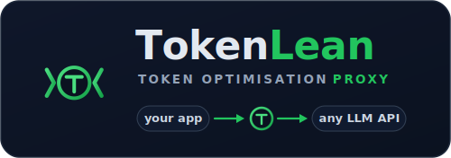
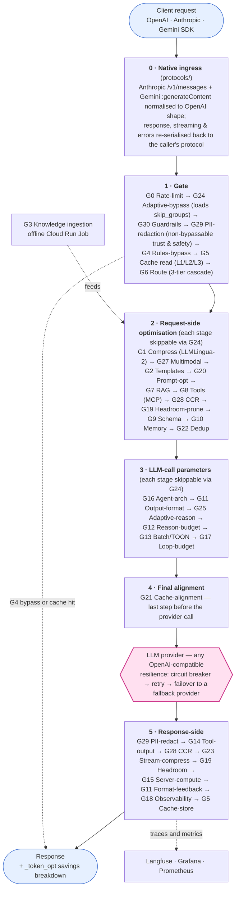
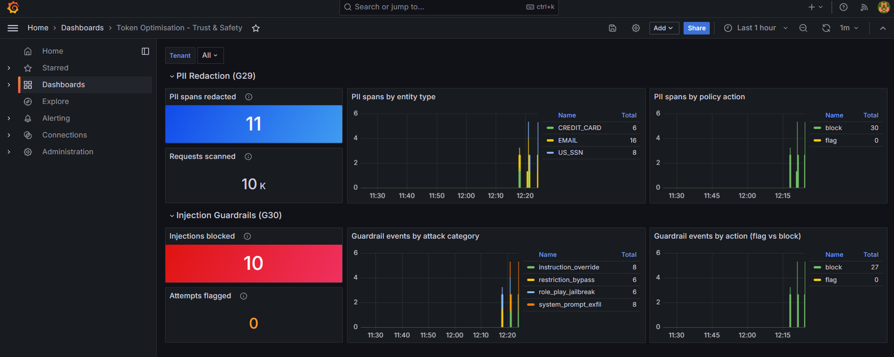
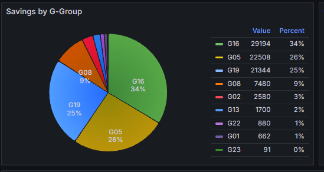
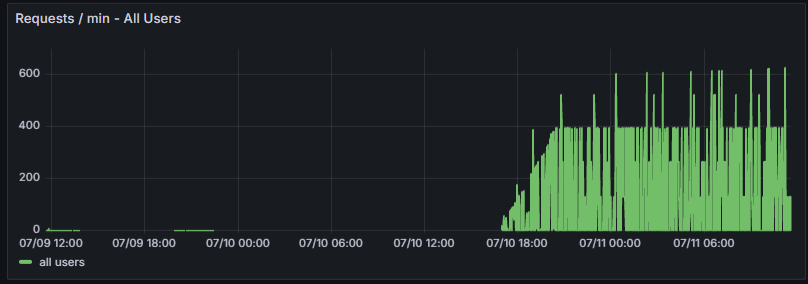

<p align="center">
  
</p>

<p align="center">
  <strong>TokenLean — the Token Optimisation Proxy.</strong><br>
  Cut your LLM token bill 30–70% with a one-line code change and zero quality loss.
</p>

<p align="center">
  ☁️ <strong>Don't want to self-host?</strong> Get it as a fully-managed SaaS —
  <a href="https://tokenlean.cbeyond.cloud/" target="_blank" rel="noopener"><strong>tokenlean.cbeyond.cloud</strong></a>
</p>

[](https://github.com/sumitdevgupto/TokenLean/actions/workflows/ci.yml)
[](LICENSE)
[](https://www.python.org/downloads/)
[](#g0g30-optimisation-and-safety-groups)
[](https://github.com/sumitdevgupto/TokenLean/stargazers)

**TokenLean** is a production-ready proxy (run locally or GCP-hosted) that sits between your app and any LLM provider and transparently shrinks every request — prompt compression, semantic caching, model routing, prefix-cache alignment, structured pruning, and **22 more techniques**. Point your existing OpenAI client at it and keep your code exactly as-is.

🎯 **54.1% quality-gated** token savings in live ablation &nbsp;·&nbsp; 🔌 **10 first-class providers** + any OpenAI-compatible API &nbsp;·&nbsp; 🧩 **27 techniques** (G0–G28, G26 reserved) &nbsp;·&nbsp; 🏷️ **100% open source** (Apache-2.0) &nbsp;·&nbsp; 💸 **scales to zero** (~$2/mo idle on Cloud Run)

> **Savings by workload** (quality-gated, only counting datasets where answer quality held): **cache 92.8%** · **agentic 46.0%** · **prose 38.1%** · **reasoning −2.7%**. Input-token savings only — separate from output cost and from request-count billing. The headline carries run-to-run variance (borderline datasets flip PASS/FAIL under model nondeterminism even at temperature-0: **~51–56% observed** across gated runs; ungated ceiling ~52%).

> 💵 **Cost savings** run **~70%** on the same gated workloads (config-priced estimate — **directional, not invoice-grade**, and run-variable). Reported separately from the token metric on purpose: routing swaps models (a cost lever) without always cutting input tokens, and dollar figures come from a static price table, not real invoices.

**Why teams use it:**
- 🪄 **Drop-in** — change one line (`base_url`), not your prompts or your SDK. Works from the **OpenAI SDK** (`/v1/chat/completions`), the **Anthropic SDK / Claude Code** (`/v1/messages`), and the **Gemini SDK** (`generateContent`) — the proxy translates each natively while applying every optimisation
- 📉 **Broad reduction** — 27 stacked techniques from the Token Optimisation Playbook v7, not just caching
- 🔍 **Always measured** — every response carries a `_token_opt` savings breakdown; per-call → quarterly Grafana dashboards
- 🏢 **Multi-tenant by default** — per-tenant Redis/Qdrant namespacing, rate limits, config overrides
- 🛡️ **Reliable & safe** — provider **failover** (circuit breaker + retry + per-tenant cooldown) keeps a request serving when an upstream degrades; **trust & safety** guardrails (G30 injection / G29 PII) run non-bypassably before any tokens are spent
- ♻️ **Hot-reload config** — tune or A/B any technique without a redeploy
- 🧱 **100% OSS stack** — LiteLLM, LLMLingua-2, Qdrant, Langfuse, Grafana, Jaeger, Temporal

---

## Why a token-optimisation *layer* (not another gateway)?

Most LLM infrastructure operates at the **gateway** layer — unified routing, key
management, observability, guardrails. This project is deliberately different: it
is the **transparent optimisation layer** that targets the one thing gateways
don't prioritise — **breadth of token reduction** (27 techniques, 30–70% / up to
**54.1% quality-gated**) — and drops in *in front of, or inside,* any gateway.

| Capability | **This project** | LiteLLM | Helicone | Portkey | Bifrost |
|---|---|---|---|---|---|
| Primary role | **Token-reduction layer** | Unified gateway | Observability-first | Gateway + guardrails | High-perf gateway (Go) |
| Transparent optimisation techniques | **27 (G0–G28, G26 reserved)** | few (cache, routing) | observability-focused | some (cache, guardrails) | few (cache, load-balancing) |
| Prompt compression (LLMLingua-2) | ✅ | — | — | — | — |
| Multi-level + semantic cache (L1/L2/L3) | ✅ | basic | — | ✅ | ✅ |
| Model routing / 3-tier cascade | ✅ (+ RouteLLM) | ✅ | — | ✅ | ✅ |
| Provider failover / circuit breakers | ✅ | ✅ | — | ✅ | ✅ |
| Native multi-protocol ingress (OpenAI · Anthropic · Gemini) | ✅ | partial | — | partial | — |
| Trust & safety (PII redaction · injection guardrails) | ✅ (G29/G30) | — | — | ✅ | — |
| Provider prefix-cache alignment | ✅ (up to ~84% on prefix) | — | — | — | — |
| Structured/AST pruning · dedup · CCR | ✅ | — | — | — | — |
| Drop-in OpenAI-compatible (any provider) | ✅ (10 first-class + config) | ✅ | ✅ | ✅ | ✅ |
| Self-host · Apache-2.0 | ✅ | ✅ | ✅ | ✅ | ✅ |
| Complements your existing gateway | ✅ sits in front / inside | — | — | — | — |

> **How to read this table.** ✅ = documented capability. "—" means **not a documented focus** in that
> project's public docs as of July 2026 — *not* a claim that it is technically impossible or absent from a
> fork/roadmap. Qualifiers ("few", "basic", "some") are directional summaries, not benchmarks. This space
> moves fast, so **verify against each project's current docs** — and please
> [open an issue or PR](https://github.com/sumitdevgupto/TokenLean/issues) if any cell is out of date.
>
> This project's own figures (**54.1%**, up to **~84%**, **27 techniques**) are **self-measured** on our
> live-ablation test harness — directional estimates, not an independent third-party benchmark.
>
> **Sources:** [LiteLLM](https://docs.litellm.ai/) · [Helicone](https://docs.helicone.ai/) ·
> [Portkey](https://portkey.ai/) · [Bifrost](https://docs.getbifrost.ai/). LiteLLM, Helicone, Portkey and
> Bifrost are trademarks of their respective owners, referenced here for identification and comparison
> only; no affiliation or endorsement is implied.

**Bottom line:** keep your gateway. Put this in front of it (or point it at one)
and capture the 30–70% token savings the gateway layer doesn't target.

---

## Supported Providers

**10 first-class providers** — each has a maintained adapter, default config, and pricing. The
**`name`** is the `providers[].name` in `config.yaml` and selects the key var `LLM_KEY_<NAME>`:

| Provider | config `name` | Auth (local env) | Example model |
|---|---|---|---|
| OpenAI | `openai` | `LLM_KEY_OPENAI` | `gpt-4o-mini` |
| Anthropic | `anthropic` | `LLM_KEY_ANTHROPIC` | `claude-haiku-4-5` |
| Google Gemini | `gemini` | `LLM_KEY_GEMINI` | `gemini-2.5-flash` |
| Azure OpenAI | `azure` | `LLM_KEY_AZURE` + endpoint/version in config | `azure/<deployment>` |
| AWS Bedrock | `bedrock` | `AWS_ACCESS_KEY_ID` / `AWS_SECRET_ACCESS_KEY` / `AWS_REGION_NAME` (SigV4, no API key) | `bedrock/anthropic.claude-3-5-sonnet` |
| Mistral | `mistral` | `LLM_KEY_MISTRAL` | `mistral-small-latest` |
| Cohere | `cohere` | `LLM_KEY_COHERE` | `command-r` |
| xAI (Grok) | `xai` | `LLM_KEY_XAI` | `grok-2` |
| DeepSeek | `deepseek` | `LLM_KEY_DEEPSEEK` | `deepseek-chat` |
| Groq | `groq` | `LLM_KEY_GROQ` | `groq/llama-3.3-70b` |

Pick which to use by setting `proxy.default_provider` and the model name in your request — routing is
prefix-based from the `providers:` config.

**Any other provider** that exposes an OpenAI-compatible API (Kimi/Moonshot, GLM/Zhipu, Qwen, Perplexity,
OpenRouter, Together, a local vLLM/Ollama shim, …) works with **config alone — no code**. Providers with
a different API shape take a small in-repo adapter. Full step-by-step, plus when a provider needs a
product request: **[docs/extensibility.md](docs/extensibility.md)**.

---

## Quick Start

### One-Command Deploy

```bash
git clone https://github.com/sumitdevgupto/TokenLean
cd TokenLean
cp infra/terraform.tfvars.template infra/terraform.tfvars
# Edit terraform.tfvars with your GCP project ID
./scripts/gcp/gcp-deploy.sh
```

### One-Line Developer Integration

Point your existing SDK's base URL at the proxy — **no prompt or code changes**. The proxy
speaks each provider's native wire protocol (request, response, streaming, errors, and tool
calls) while applying every optimisation, so the one-line swap works whether you use the
OpenAI, Anthropic, or Gemini SDK (including **Claude Code** via `/v1/messages`) — multi-turn
agentic tool use round-trips structurally too.

**OpenAI SDK** → `/v1/chat/completions`
```python
client = OpenAI(
    api_key=os.environ["PROXY_API_KEY"],      # Proxy-issued key (not the LLM key)
    base_url=os.environ["PROXY_ENDPOINT"] + "/v1"
)
```

**Anthropic SDK / Claude Code** → `/v1/messages`
```python
client = anthropic.Anthropic(
    api_key=os.environ["PROXY_API_KEY"],
    base_url=os.environ["PROXY_ENDPOINT"]     # x-api-key auth handled natively
)
```

**Gemini SDK** → `…/v1beta/models/{model}:generateContent`
```python
client = genai.Client(
    api_key=os.environ["PROXY_API_KEY"],      # x-goog-api-key / ?key= handled natively
    http_options={"base_url": os.environ["PROXY_ENDPOINT"]}
)
```

The proxy is OpenAI-shaped internally; each request is normalised in and the response
re-serialised back to your SDK's native shape (`ctx.ingress_protocol` records which one, for
observability — billing is one row per served request regardless of protocol).

See [docs/client-onboarding.md](docs/client-onboarding.md) for Python, Java, and Go examples.

---

## Architecture



> Stages run in the exact order above (source of truth: `src/proxy/middleware/pipeline.py`).
> **Stage 0 · Native ingress** translates an Anthropic (`/v1/messages`) or Gemini
> (`:generateContent` / `:streamGenerateContent`) request into the OpenAI shape the pipeline speaks,
> then re-serialises the response — so the pipeline stays protocol-agnostic and the OpenAI path is
> unchanged. **G24 runs first** and can skip any later stage per request; **G21** is the last step
> before the provider call. **G4 bypass** and an **L1/L2/L3 cache hit** short-circuit straight to the
> response. **G3** is an offline ingestion job that feeds the G7 RAG index. (G26 is a reserved slot.)
> **G30 (injection guardrails) + G29 (PII redaction)** run right after G24, **unconditionally** —
> they are never skipped by G24, cover bypass/cache traffic, and redact before any content-persisting
> stage. A guardrail block or a PII-policy block returns an OpenAI content-filter 200.
> The **provider call is wrapped in the resilience layer** — a circuit breaker + retry that fails over
> to a configured fallback provider before any bytes are sent, so one upstream outage doesn't take the
> request down.

## Beyond token reduction — reliability, safety & reach

Three capabilities that make the proxy production-grade for enterprise traffic — all OSS (Apache-2.0), never tier-gated:

### 🔁 Provider failover & resilience
An outage on one upstream shouldn't take your app down. Every provider call runs through a resilience layer (`providers/resilience.py`):
- **Circuit breaker** — a provider that keeps failing is paused (*open*) and auto-probed back to health (*half-open → closed*), so you stop hammering a dead upstream.
- **Retry + failover** — a transient error retries, then fails over to a configured **fallback provider** *before any bytes reach the client*. On swap, cost and provider attribution follow whoever actually served.
- **Per-tenant cooldown / lockout** — a rate-limited key is skipped for a short window while other keys and providers keep serving; state is Redis-backed so it holds across workers.

Configure per provider under `providers.<name>.resilience` (fallbacks, `num_retries`, `cooldown_time`, breaker thresholds). The safe default is **retry-only** — add `fallbacks` to turn on cross-provider failover. Circuit-breaker state and failover rate surface on the **SLA dashboard** and the portal SLA view.

### 🛡️ Trust & safety — G29 PII · G30 injection guardrails
Run **unconditionally right after G24** — before any optimisation spends tokens, and before any stage that persists content (cache / embeddings / memory / CCR), so they can't be bypassed and cover cache/bypass traffic too:
- **G30 injection guardrails** — a precision-biased ruleset flags or blocks prompt-injection & jailbreak attempts (`allow | flag | block`). A block returns an OpenAI **content-filter 200**, not a 500.
- **G29 PII redaction** — detects email / SSN / card / phone / IP (+ optional Presidio) and applies your policy (`off | flag | mask | block`) with **reversible masking** so downstream answers stay coherent.

Per-tenant policy, **PII-free audit rows**, Prometheus counters, and a Trust & Safety dashboard. The managed red-team ruleset feed, portal Security tab, and compliance attestation are the commercial layer.

<p align="center">
  <br>
  <em>Trust &amp; Safety dashboard — PII spans redacted and injection attempts blocked, broken out by entity type (<code>EMAIL</code>, <code>CREDIT_CARD</code>, <code>US_SSN</code>) and attack category (<code>instruction_override</code>, <code>role_play_jailbreak</code>, <code>system_prompt_exfil</code>).</em>
</p>

### 🔌 Native multi-protocol ingress
The one-line base-URL swap works from the **OpenAI**, **Anthropic** (`/v1/messages` — Claude Code included), and **Gemini** (`:generateContent` / `:streamGenerateContent`) SDKs, with each SDK's native auth (`x-api-key` / `x-goog-api-key` / `?key=`). Every request is normalised into the OpenAI-shaped pipeline and the response re-serialised — non-streaming, streaming, error envelopes, **and tool/function calls** — back to your SDK's native shape. Multi-turn agentic tool use round-trips **structurally** (not as text): Anthropic `tool_use`/`tool_result` and Gemini `functionCall`/`functionResponse` map to well-formed OpenAI `tool_calls`/`tool` messages both ways, so an agentic loop through `/v1/messages` (Claude Code) or `generateContent` keeps full tool-call fidelity across turns. Every optimisation applies; billing is one row per served request regardless of protocol.

| Client | Endpoint |
|---|---|
| OpenAI SDK | `POST /v1/chat/completions` |
| Anthropic SDK / Claude Code | `POST /v1/messages` |
| Gemini SDK | `POST /v1beta/models/{model}:generateContent` · `:streamGenerateContent` |

## Deployment Options

| Command | Use Case | Time |
|---------|----------|------|
| `./scripts/gcp/gcp-deploy.sh` | First-time deployment (includes Terraform infrastructure) | ~15-20 min |
| `./scripts/gcp/gcp-deploy.sh --skip-infra` | Code changes only (no infrastructure changes) | ~5 min |
| `./scripts/gcp/stop-gcp.sh` | Pause GCP infrastructure (~$2/month cost) | ~2 min |
| `./scripts/gcp/start-gcp.sh` | Resume GCP from paused state | ~5 min |
| `./scripts/local/deploy-local.sh --seed` | Deploy locally via Docker (zero GCP cost) | ~5 min |
| `./scripts/local/stop-local.sh` | Stop local Docker stack | ~10 sec |

See [DEPLOYMENT.md](DEPLOYMENT.md) for complete details.

## Repository Structure

```
src/
├── proxy/                  # Core LiteLLM proxy + G0–G30 middleware pipeline
│   ├── middleware/         # G0–G30 middleware files (g00_rate_limit.py … g30_guardrails.py)
│   ├── protocols/          # Native multi-protocol ingress (OpenAI · Anthropic · Gemini translators)
│   ├── guardrails/         # Trust & safety engines — G29 PII detector + G30 injection scanner
│   ├── providers/          # Provider adapters + resilience.py (circuit breaker / retry / failover)
│   ├── savings/            # Per-step savings calculator + cost models
│   └── auth/               # Proxy key validation (GCP Secret Manager)
├── llmlingua-sidecar/      # G1: LLMLingua-2 HTTP compression sidecar
├── doc-pipeline/           # G3: Document ingestion Cloud Run Job
├── finetune-pipeline/      # G3: Fine-tuning pipeline (Vertex AI/OpenAI)
├── tika-sidecar/           # Apache Tika 2.9.1 for document parsing
└── templates/              # G16: Developer starter kits (Python / Java / Go)
config/                     # Externalised config (hot-reloaded from GCS)
dashboard/                  # Grafana dashboards (per-call/live/trends/billing/sla/trust-safety/requests)
infra/                      # Terraform (Cloud Run, Cloud SQL, Redis, Secret Manager)
scripts/                    # Deployment, validation, and operational scripts
ci/                         # Cloud Build + budget validation pipelines
docs/                       # Developer and operator documentation
tests/                      # Unit and integration tests (pytest)
```

## G0–G30 Optimisation and Safety Groups

27 token-optimisation techniques (G0–G28, G26 reserved) plus two trust & safety groups (G29 PII, G30 injection guardrails). The Savings column applies to the optimisation groups; G29/G30 are safety controls, not token-savers.

| Group | Technique | Savings | Key Implementation |
|-------|-----------|---------|-------------------|
| **G1** | Prompt Compression | 20-50% | LLMLingua-2 sidecar with layered composition (base→role→task→dynamic) |
| **G2** | Template Registry | 10-30% | Versioned templates with PR-diff token checks |
| **G3** | Knowledge Strategy | 15-40% | RAG with OOD detection, fine-tuning pipeline with break-even detection. Opt-in **PII/PHI redaction at ingest** (`INGEST_PII_MODE`) so the vector store never holds raw personal data; **freshness metadata** (`ingested_at`/`source_date`) with a `max_age_days` stale-context filter |
| **G4** | Rules-Based Bypass | 100% | PostgreSQL cache with exact/fuzzy matching (pg_trgm) |
| **G5** | Response Caching | 30-80% | L1 Redis exact-match + L2 pgvector semantic + L3 GPTCache. `cache_scope`: `tenant` (default — reuse across providers) or `tenant+model` (isolate per requested model for deliberate multi-provider tenants) |
| **G6** | Model Routing | 40-70% | Three-tier cascade (fast→confidence check→escalation→rollback) |
| **G7** | Retrieval Optimisation | 20-35% | Hybrid RAG (dense + sparse) with reranking |
| **G8** | Tool Loading | 10-20% | MCP lazy-load manifest protocol with scheduled pruning |
| **G9** | Context Schema | 15-25% | Instructor library with timeout fallback to heuristic |
| **G10** | Memory Management | 20-40% | Mem0 OSS integration for long-horizon conversation memory |
| **G11** | Output Format | 10-25% | Auto max_tokens with Redis feedback loop (p95 tuning) |
| **G12** | Reasoning Budget | 10-30% | Low/medium/high effort suppression prompts |
| **G13** | Batch/Compact | 25-60% | TOON (Token-Optimized Object Notation) + Kafka batching |
| **G14** | Tool Output | 15-30% | Dependency-aware parallel tool combining |
| **G15** | Server Compute | Variable | MCP SDK server dispatch for external handlers |
| **G16** | Agent Architecture | 5-20% enforced (truncation + tool pruning); 20-45% with manual role decomposition | LangGraph + Temporal runtimes with cost modeling |
| **G17** | Loop Control | 10-20% | Inter-agent state via HTTP headers + token budgets |
| **G18** | Observability | N/A | Langfuse tracing + Grafana dashboards + admin webhooks |
| **G19** | Structured Pruning | up to ~40% | AST-aware compression of code/JSON/logs/text (Headroom); request + response |
| **G20** | Prompt Optimization | 5-15% | Inline application of offline-optimised prompts (Opik/DSPy) |
| **G21** | Cache Alignment | up to ~84% on cached prefix | Reorder messages for provider prefix-caching (zero quality risk) |
| **G22** | Deduplication | 5-20% | Collapse near-duplicate conversation turns (cosine / n-gram) |
| **G23** | Streaming Compression | Variable | Collapse repeated n-grams in response output |
| **G24** | Adaptive Bypass | Variable | Skip groups with historically negative savings per request pattern |
| **G25** | Adaptive Reasoning | 10-30% | Classify complexity → set reasoning_effort before G12 |
| **G26** | *(reserved)* | — | Reserved slot — not implemented |
| **G27** | Multimodal Optimizer | Variable | Compress inline base64 images (Headroom + LRU cache) |
| **G28** | Context Compression & Reuse | 20-50% | Replace repeated blocks with `[CCR:sha256]` + headroom MCP tools |
| **G29** | PII Redaction *(trust & safety)* | — | Detect + `off\|flag\|mask\|block` personal data (email/SSN/card/phone/IP + optional Presidio) before the provider call. Opt-in **PHI** (DEA/NPI/MRN/ICD-10) via `phi: true` |
| **G30** | Injection Guardrails *(trust & safety)* | — | Detect prompt-injection / jailbreak attempts in the user prompt; `allow\|flag\|block`; non-bypassable, runs before optimisation spends tokens. Optional response-side scan (`scan_response`) also checks the model's **output** |
| **G31** | Context-Trust *(trust & safety)* | — | Indirect / RAG prompt-injection defence — re-scans retrieved documents + memories (injected after G30) for injection; `allow\|flag\|block\|strip`; non-bypassable |

> **G29/G30/G31 are trust & safety groups, not token-savings optimisations** — they don't contribute to the 54.1% headline and are kept out of the ablation harness. All groups are OSS (Apache-2.0) and never tier-gated; the managed red-team ruleset feed, the portal Security tab, and the compliance attestation are the commercial layer.

See [docs/request-flow-diagram.md](docs/request-flow-diagram.md) for the full pipeline order and per-group flow.

## Tuning Knobs — Savings vs Quality

**Savings never come at the cost of quality by default.** Every group is config-driven (`groups.<G>` in [config/config.yaml.template](config/config.yaml.template)), and each ships a **quality-safe default**. The knobs below are the ones that trade token savings against output quality — turn them up for more savings, or leave them at (or below) the default to protect quality. Every knob is per-tenant overridable and hot-reloaded (~60s, no redeploy). This table lists the highest-impact knob(s) per group; the **complete parameter list with every default lives in [docs/config-reference.md](docs/config-reference.md).**

| Group | Key quality knob(s) — default | Turn **up** savings → | Protect **quality** ← |
|-------|-------------------------------|------------------------|------------------------|
| **G1** Compression | `compression_ratio_target` 0.5; `min_tokens_to_compress` 200; `compress_user_messages`/`compress_system_prompt` false | lower ratio, lower min, enable user/system compression | keep user/system **off**; raise min; ratio ≥ 0.5 |
| **G2** Template Registry | `budgets.<id>.{system_prompt_max, total_input_max, output_max}` | tighter token budgets per template | looser budgets; leave `budget.truncate_enabled` off |
| **G3** Knowledge Strategy | `chunk_size_tokens` 400; `rag_fallback.top_k` 5; `rag_fallback.similarity_threshold` 0.85 | fewer/smaller chunks, higher threshold | more chunks, lower threshold for recall |
| **G4** Rules Bypass | `default_confidence_threshold` 0.7; `keyword_weight` 0.4 / `pattern_weight` 0.6 | lower threshold → bypass more | raise threshold → only high-confidence bypass |
| **G5** Response Caching | `l2_similarity_threshold` 0.9; `l3_similarity_threshold` 0.85; `semantic_skip_multiturn` true; `cache_scope` tenant | lower thresholds → more cache hits | raise thresholds; keep multi-turn skip on; `tenant+model` scope |
| **G6** Model Routing | `tiers.{simple,medium,complex}`; `cascade_confidence_threshold` 0.7; `routellm.threshold` | route more to cheap tier (lower threshold) | raise threshold → escalate sooner to strong model |
| **G7** Retrieval | `top_k` 3; `top_k_after_rerank` 1; `similarity_threshold` 0.85; `max_total_context_tokens` 4000 | fewer chunks, higher threshold, smaller context | more chunks / larger context for completeness |
| **G8** Tool Loading | `max_tools_per_agent` 20 | fewer tools injected | raise cap so no needed tool is pruned |
| **G9** Context Schema | `enabled` false; `prose_min_length_chars` 80 | enable prose→schema compaction | keep off, or raise min length |
| **G10** Memory | `sliding_window_turns` 6; `skills_top_k` 2; `skills_similarity_threshold` 0.7 | fewer verbatim turns; fewer skills | keep more turns verbatim; lower skill threshold |
| **G11** Output Format | `enforce_max_tokens` true; `default_max_tokens_multiplier` 2.0; `tighten_quantile` 0.95; `tighten_multiplier` 1.2 | lower multiplier/quantile → tighter caps | raise multiplier so long answers aren't truncated |
| **G12** Reasoning Budget | `default_effort` medium; `effort_map.*` per-provider thinking budgets | lower effort / smaller budgets | raise effort for hard reasoning tasks |
| **G13** Batch / TOON | `toon_require_net_savings` true; `toon_uniform_threshold` 1.0; `provider_native` false | relax uniformity; enable native batch lane | keep `toon_require_net_savings` on (never inflates) |
| **G14** Tool Output | `field_whitelist.*`; `spreadsheet_compression` true | whitelist fewer fields; keep compression on | whitelist all fields the model needs downstream |
| **G15** Server Compute | `hooks` (filter/sort/project on tool results) | add hooks that shrink tool payloads | keep hooks that drop only redundant data |
| **G16** Agent Architecture | `max_system_prompt_tokens` 4096; `max_tools_per_agent` 20; `tool_selection_strategy` relevance | lower caps → more truncation/pruning | raise caps so prompts/tools aren't cut |
| **G17** Loop Control | `max_iterations` 10; `starting_budget_tokens` 10000; `confidence_stop_threshold` 0.95 | fewer iterations, smaller budget, earlier stop | more iterations/budget for complex workflows |
| **G18** Observability | *(no quality trade-off — pure metrics/tracing)* | — | — |
| **G19** Structured Pruning | `min_length_to_compress` 50; `compression_strategies.{json,code,logs,text}` | lower min; enable more strip strategies | raise min; disable lossy strategies (e.g. `strip_comments`) |
| **G20** Prompt Optimization | `quality_threshold` 0.95; `max_prompt_tokens` 4000 | accept prompts at lower quality score | raise threshold → only accept ≥95% eval-quality prompts |
| **G21** Cache Alignment | *(zero quality risk by design — request content unchanged)* | `providers.*` control provider cache credit | — |
| **G22** Deduplication | `dedup_threshold` 0.92; `tenant_thresholds` | lower threshold → collapse more turns | raise threshold → only near-identical turns merged |
| **G23** Streaming Compression | `min_repeat` 3; `ngram_size` 5 | lower `min_repeat` → compress more | raise `min_repeat` → only heavy repetition collapsed |
| **G24** Adaptive Bypass | `rules_file` (per-rule skip conditions) | add skip rules for negative-savings patterns | scope rules tightly (token/model/tenant conditions) |
| **G25** Adaptive Reasoning | `effort_floor` low / `effort_ceiling` high; `{high,medium,low}_keywords` | lower ceiling → cap reasoning effort | raise floor/ceiling for reasoning-heavy workloads |
| **G26** *(reserved)* | — | — | — |
| **G27** Multimodal | `quality` 75; `min_bytes` 4096 | lower JPEG quality; lower min bytes | raise quality for detail-critical images |
| **G28** Context Reuse (CCR) | `enabled` false; `min_tokens` 300; `compress_system_prompt` false | enable for agent clients; lower min | keep `compress_system_prompt` **off** in pass-through |

> Groups **G18** and **G21** have no savings-vs-quality trade-off (observability and prefix-cache alignment respectively). **G26** is a reserved, unimplemented slot.

## Savings Tracking

Every LLM response includes detailed savings metadata:

```json
{
  "choices": [...],
  "_token_opt": {
    "baseline_tokens": 450,
    "final_tokens_sent": 220,
    "total_abs_saving": 230,
    "total_pct_saving": 51.1,
    "cache_hit": false,
    "routed_model": "gpt-4o-mini",
    "cost_baseline_usd": 0.002250,
    "cost_actual_usd": 0.000033,
    "cost_saving_usd": 0.002217,
    "step_savings": {
      "G01": { "abs_saving": 85, "pct_saving_vs_baseline": 18.9 },
      "G05": { "abs_saving": 0,  "pct_saving_vs_baseline": 0.0 },
      "G06": { "abs_saving": 0,  "pct_saving_vs_baseline": 0.0, "description": "Routed gpt-4o → gpt-4o-mini" },
      "G10": { "abs_saving": 145, "pct_saving_vs_baseline": 32.2 }
    }
  }
}
```

> **Fair-disclosure on cost figures.** `cost_baseline_usd` / `cost_actual_usd` /
> `cost_saving_usd` are **config-priced estimates** — token counts multiplied by a
> static `pricing:` table in config. They are **directional, not invoice-grade**:
> they do not reflect negotiated discounts, provider-side prompt caching, batch or
> reasoning surcharges, or currency effects, and `baseline_tokens` is a
> counterfactual (what *would* have been sent without optimisation). Token-count
> savings are measured directly; dollar figures are an estimate. Provider-reconciled
> billing is a separate, non-OSS concern.

**Dashboards:** Access Grafana at `https://grafana-<hash>-uc.a.run.app` for per-call, live, trends (switch bucket via the `Granularity` variable: hour/day/week/month/quarter), and all-time quarterly aggregations. (Dollar panels use the same config-priced estimate — see the caveat above.)

<p align="center">
  <br>
  <em>Savings attributed per optimisation group — here G16 (agent architecture), G05 (semantic cache) and G19 (headroom pruning) lead.</em>
</p>

<p align="center">
  <br>
  <em>Live request volume through the proxy — the telemetry behind the per-call → quarterly savings views.</em>
</p>

**How dashboard values are calculated.** Grafana never reads `config.yaml` directly — it queries Postgres. The data flow is:

```
config.yaml pricing: table ─┐
                            ├─► savings/calculator.py ─► _token_opt block ─┬─► Langfuse trace metadata ─► Grafana (savings panels)
request tokens (measured) ──┘                                             └─► response body
main._record_outcome ─────────────────────────────────► token_opt.usage_events ─► Grafana (billing / tenant / SLA panels)
```

- **Savings panels** (tokens saved, % saved, $ saved) read the Langfuse DB `traces` table — e.g. `SUM((metadata->>'total_abs_saving')::int)`, `AVG((metadata->>'total_pct_saving')::float)`, `SUM((metadata->>'cost_saving_usd')::float)`. These come straight from the per-call `_token_opt` values recorded to the trace.
- **Billing / tenant-overview / SLA panels** read the application DB `token_opt.usage_events` table (via the separate `AppDB` datasource). This is the **request-count** billing track — one served request = one row — and is independent of tokens.
- **Tokens are measured, dollars are estimated.** `total_abs_saving` / `total_pct_saving` are counted directly from the request; only the `cost_*_usd` columns are derived from the static `pricing:` table, so the config-priced caveat above applies to the **dollar panels only**, not the token or request-count panels.

## Operational Scripts

### Local deployment (`scripts/local/`)

| Script | Purpose |
|--------|---------|
| `deploy-local.sh` | Deploy full stack locally via Docker Compose |
| `start-local.sh` | Start local Docker stack |
| `stop-local.sh` | Stop local Docker stack (zero cost) |
| `live_run_check.sh` | Live per-provider smoke test — preflight (Docker/proxy/config/keys) → real round-trip per provider (auto-generates a proxy key if absent) → PASS/FAIL/SKIP table. `./scripts/local/live_run_check.sh [provider\|all]` |

### GCP deployment (`scripts/gcp/`)

| Script | Purpose |
|--------|---------|
| `pre-deploy-check.sh` | Pre-flight checks for all prerequisites |
| `gcp-deploy.sh` | Full deployment or code-only redeploy |
| `post-deploy-check.sh` | Verify all services are running |
| `stop-gcp.sh` | Export Redis to GCS, stop Cloud SQL (cost savings) |
| `start-gcp.sh` | Restore Redis from GCS, start Cloud SQL |
| `gcp-running-inventory.sh` | Read-only project-wide cost sweep (all regions) + consolidated COST SUMMARY |
| `teardown-gcp.sh` | Delete GCP resources; `--full` clean slate, `--nuke` empty the project to the GCP floor (keeps project + KMS ring), ends with a consolidated status |

### Shared / utilities (`scripts/`)

| Script | Purpose |
|--------|---------|
| `seed-data.sh` | Seed Qdrant (auto-detects GCP or local) |
| `check-local-and-gcp-status.sh` | Show GCP + local Docker status |
| `validate-cascade.py` | Ground-truth validation for G6 routing thresholds |
| `check-stale-templates.py` | Detect and flag 30-day stale templates |

## Technology Stack

| Layer | Technology | Purpose |
|-------|-----------|---------|
| **Proxy Base** | LiteLLM | OpenAI-compatible API gateway |
| **Compression** | LLMLingua-2 | Prompt compression (G1) |
| **Caching** | Redis 7 + pgvector | L1 exact-match + L2 semantic cache |
| **RAG** | Qdrant + sentence-transformers | Vector search (G7) |
| **Routing** | RouteLLM | Model selection (G6) |
| **Memory** | Mem0 OSS + Qdrant | Long-horizon conversation memory (G10) |
| **Orchestration** | LangGraph + Temporal | Agent runtime (G16) |
| **Observability** | Langfuse + Grafana + Prometheus | Tracing and dashboards (G18) |
| **Infrastructure** | Terraform + GCP Cloud Run | Serverless deployment |
| **Config** | GCS + hot-reload | Externalised configuration |

## Configuration

All parameters externalised in `config/config.yaml.template` — no hardcoded values, no secrets in code.

**Key features:**
- Config stored in GCS and hot-reloaded every 60 seconds
- Modify config without redeploying code
- Per-group enable/disable flags for A/B testing
- **Quality-safe defaults** — every savings-vs-quality knob ships at a quality-preserving default; tune per workload using the [Tuning Knobs table](#tuning-knobs--savings-vs-quality) above

See [docs/config-reference.md](docs/config-reference.md) for all parameters.

## MCP Server Configuration

The framework provides **full MCP (Model Context Protocol) server support** through G8 (Tool Loading) and G15 (Server Dispatch) middleware.

### Enabling MCP Support

Add to your `config/config.yaml`:

```yaml
groups:
  # G8 — lazy tool-manifest loading (wired). `mcp_servers` is a list of OBJECTS.
  G8_tools:
    mcp_servers:
      - url: "https://mcp-server-1.example.com"
        filter_tools: []          # optional allow-list of tool names ([] / omit = all)
      - url: "https://mcp-server-2.example.com"
    max_tools_per_agent: 20       # prune beyond this count
    pruning:
      enabled: true
      inactivity_threshold_days: 30

  # G15 — server-side compute + Headroom MCP tool hosting (wired).
  G15_server_compute:
    enabled: true
    headroom_mcp_server: true     # host headroom_compress/retrieve/stats MCP tools
    hooks: []                     # optional filter/sort/project transforms on tool results
```

> **Notes.**
> - `G8_tools.mcp_servers` entries are **objects** (`{url, filter_tools}`), not bare URL strings.
> - Manifest/registry cache TTLs and the pruning threshold are **environment variables**
>   (`MCP_MANIFEST_CACHE_TTL_SECONDS`, `TOOL_REGISTRY_CACHE_TTL_SECONDS`,
>   `TOOL_INACTIVITY_THRESHOLD_DAYS`), not config keys — see [docs/config-reference.md](docs/config-reference.md).
> - The low-level dispatch handler registry (`G15MCPDispatch` in `g15_mcp_dispatch.py`, with
>   `mcp_dispatch_enabled` / `mcp_servers`) is an **SDK module not wired into the default pipeline**;
>   the wired server-compute path is `G15ServerCompute` shown above.

### How It Works

| Phase | Middleware | Function |
|-------|-----------|----------|
| **Discovery** | G8 | Lazy-loads tool manifests from MCP servers via `/.well-known/mcp-manifest.json` |
| **Execution** | G15 | Dispatches tool calls to MCP servers via `/tools/{tool_name}` endpoint |

### Features

- **Lazy Loading**: Tools are loaded on first use, reducing token overhead for unused tools
- **Manifest Caching**: MCP manifests cached in Redis (1 hour TTL by default)
- **Multi-Server Support**: Tool calls routed to first available MCP server
- **Local Handlers**: Register custom handlers for tools not available on MCP servers
- **Auto-Pruning**: Scheduled job removes tools unused for 30+ days

### Registering Local Handlers

```python
from middleware.g15_mcp_dispatch import G15MCPDispatch, register_default_handlers

g15 = G15MCPDispatch()

# Register custom handler
g15.register_handler("custom_query", async def handler(input_data):
    return {"result": await my_custom_logic(input_data)}

# Register by schema type
g15.register_schema_handler("database-query", db_query_handler)
```

### MCP Server Requirements

Your MCP servers must expose:
1. **Manifest endpoint**: `GET /.well-known/mcp-manifest.json` returning tool definitions
2. **Tool endpoint**: `POST /tools/{tool_name}` accepting JSON input and returning results

The wired tool-loading path is `src/proxy/middleware/g08_tool_loading.py`. For the lower-level SDK
modules (not in the default pipeline) see `g08_mcp_loader.py` and `g15_mcp_dispatch.py`.

## Security

| Control | Implementation |
|---------|---------------|
| LLM Provider Keys | GCP Secret Manager only (never exposed to developers); per-tenant BYOK keys Fernet-encrypted at rest |
| Developer Keys | Proxy-issued API keys with per-user rate limits |
| Authentication | Workload Identity (no JSON credential files) |
| **PII redaction (G29)** | Detect + `off\|flag\|mask\|block` email/SSN/card/phone/IP (+ optional Presidio) before the provider call; reversible masking; PII-free audit rows |
| **Injection guardrails (G30)** | Precision-biased prompt-injection / jailbreak detection; `allow\|flag\|block`; non-bypassable, runs before optimisation spends tokens |
| **Provider resilience** | Circuit breaker + retry + per-tenant cooldown + failover so one upstream outage doesn't take a request down |
| Network | VPC connector for private service communication |
| Secrets | All secrets gitignored — see `.gitignore` |

## Testing

```bash
# Install test dependencies
pip install -r tests/requirements-test.txt

# Run all tests
pytest

# Run specific test suite
pytest tests/unit/middleware/test_g01_compression.py -v

# Run with coverage
pytest --cov=src/proxy --cov-report=html
```

**Test Coverage:** 45 middleware files (42 G-group files + pipeline/context/tracing), plus the `protocols/`, `guardrails/`, and `providers/resilience` engines; integration tests for API, pipeline, multi-protocol ingress, failover, and trust-safety blocking.

## Documentation

| Document | Purpose |
|----------|---------|
| [docs/client-onboarding.md](docs/client-onboarding.md) | Client integration guide (Python/Java/Go) |
| [docs/config-reference.md](docs/config-reference.md) | Complete configuration parameter reference |
| [docs/request-flow-diagram.md](docs/request-flow-diagram.md) | Full request/response pipeline (G0–G30 + native ingress) and per-group flow |
| [docs/oss-licenses.md](docs/oss-licenses.md) | Dependency licenses (SPDX) |
| [DEPLOYMENT.md](DEPLOYMENT.md) | Complete deployment and troubleshooting guide |
| [Token Optimisation Blog](https://sumitdevgupto.github.io/token-optimisation-blog/) | Reference article — background and walkthrough of the framework |

## ☁️ Prefer it fully managed? TokenLean as a Service

Don't want to run, scale and operate the infrastructure yourself? **Cbeyond** offers
TokenLean as a **fully-managed SaaS** — hosted, auto-scaling, SLA-backed, with enterprise
security and zero ops on your side. Everything in this open-source core, run and operated
for you, so your team captures the savings on day one.

→ <strong><a href="https://tokenlean.cbeyond.cloud/" target="_blank" rel="noopener">Explore the managed &amp; Enterprise offering at tokenlean.cbeyond.cloud</a></strong>

---

## License

Licensed under the **Apache License 2.0** — see [LICENSE](LICENSE).

Third-party components: [NOTICE](NOTICE) (attribution), [THIRD_PARTY_LICENSES.md](THIRD_PARTY_LICENSES.md)
(bundled OSS services & sidecars), and [docs/oss-licenses.md](docs/oss-licenses.md)
(Python dependencies). All imported dependencies are permissive (MIT / BSD / Apache-2.0);
no GPL/AGPL code is linked in.
